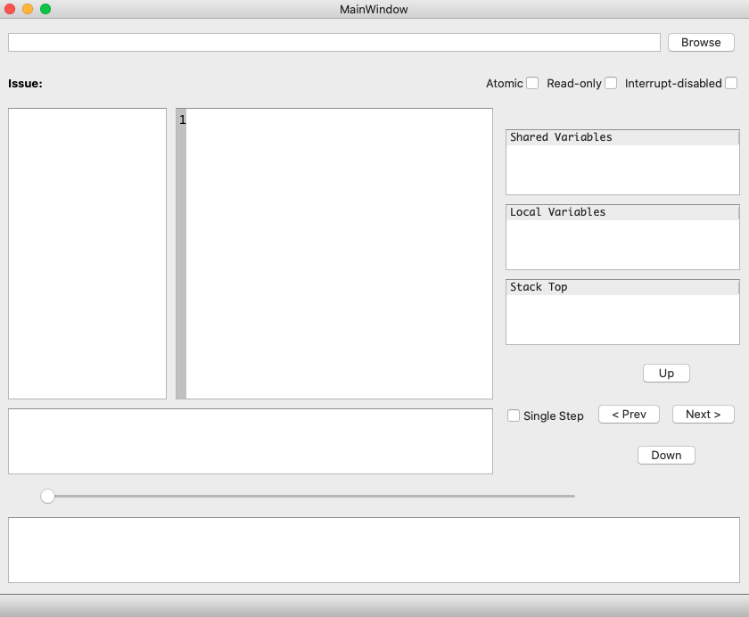
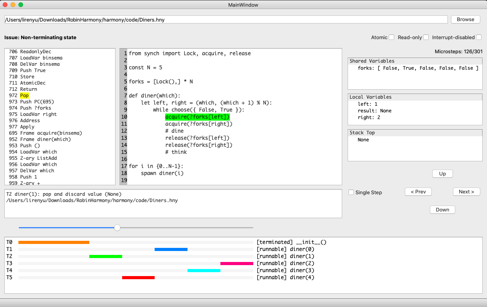

# HarmonyGUI
A GUI interface for the [Harmony](https://harmony.cs.cornell.edu/) programming language. Displays issues of concurrent programs and allows efficient debugging.
## Install
First, install Harmony compiler follwing the instructions [here](https://harmony.cs.cornell.edu/docs/textbook/install/). 
Next, copy the `gui.py` and `gui_import` in this repo into Harmony's directory.
After that, run command

    python3 gui.py

in terminal and will see a an interface like this:

Now, click the `Browse` button and select the Harmony source code files (.hny) you want to open. The code will compile automatically and you will be able to debug the code with our graphical interface! Here is an example of the Dining Philosophers code: 

As you can see, the Harmony source code in the middle, the byte code is to its left, and there is a bar at the bottom showing thead execution status. You can also monitor the variables in the right and step through the code using the buttons and the horizontal scroll bar. 

Now, you are free to use the Harmony model checker to debug your concurrent programs!